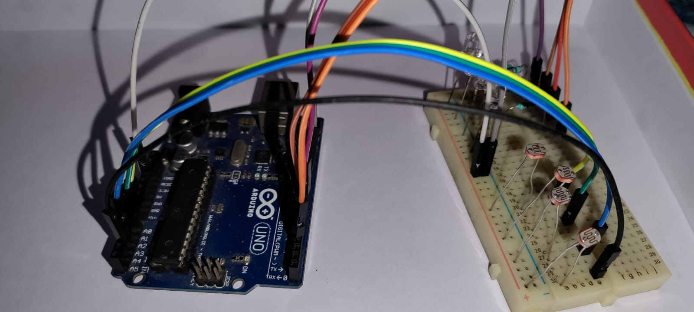
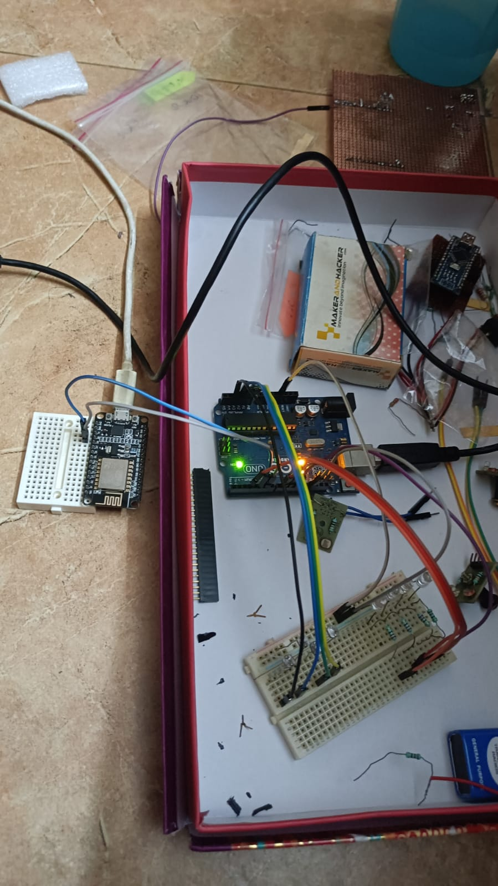
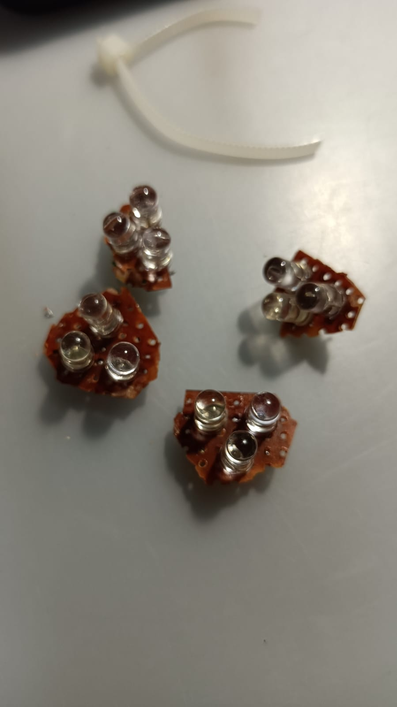
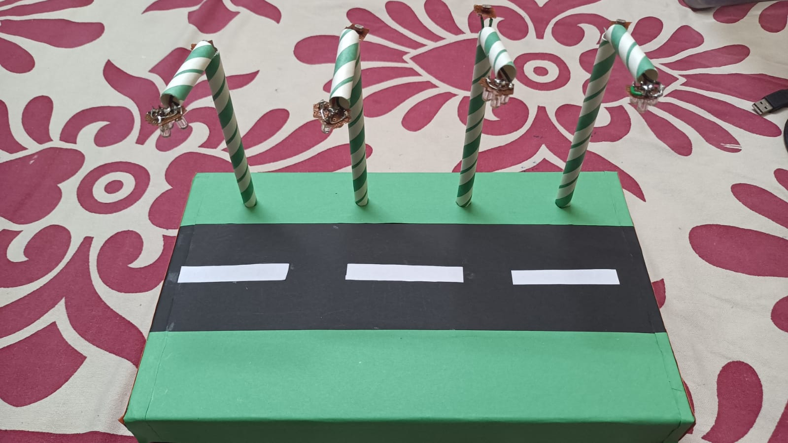
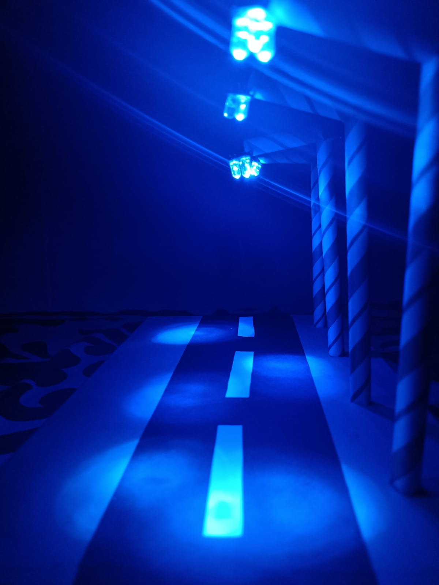
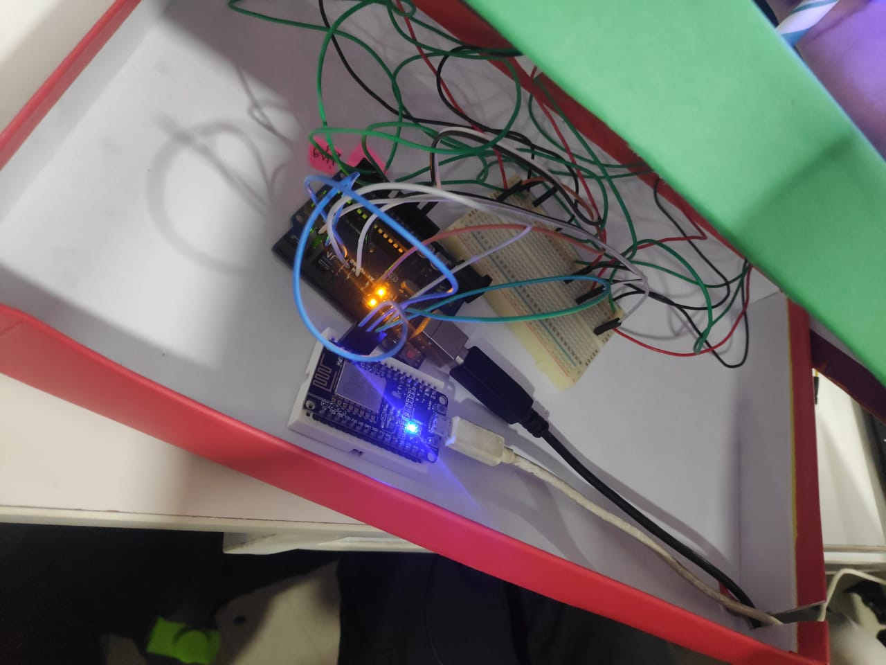
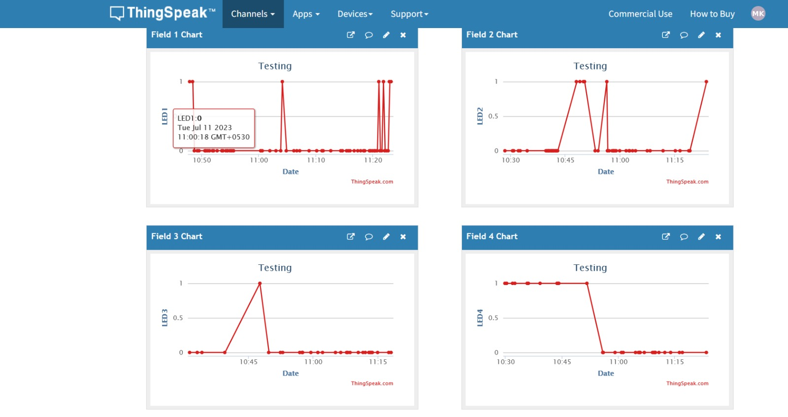

**[Assessment -- 5]{.underline}**

**[Smart Street Lighting]{.underline}**

(Team Project)

**[Aim:]{.underline}**

To implement an intelligent street lighting system that adjusts the
brightness of streetlights based on ambient light levels. This helps in
automation and remote monitoring of street-light infrastructure.

**[Abstract:]{.underline}**

The project aims to showcase a prototype for an intelligent street
lighting system. This proof-of-concept project uses Arduino UNO as well
as NodeMCU (ESP8266 -- Used for its Wi-Fi module). A simple,
cost-effective Light Dependant Resistor (LDR) is used as the sensor in
the setup. Street lamps are made by using paper straws and 3 LEDs
connected in parallel. The resistance of LDRs decreases with increase in
the intensity of incident light, so the current passing through them
increases -- this is read by the Arduino board, which then performs
necessary calculations based on pre-determined constants. According to
the threshold values set, if ambient light goes above the threshold, the
lamps turn off (because there is enough light). If the ambient light
value goes below this threshold, the lamp brightness is automatically
controlled based on the ambient lighting: higher the brightness level,
lower the lamp's intensity. The Arduino UNO is connected to a NodeMCU
and performs parallel and serial communication with it. The Arduino
sends Lamp status in the form of 1's and 0's (1 being ON and 0 being
OFF) to NodeMCU's digital pins and prints the lamp intensity on
NodeMCU's Serial Monitor. The NodeMCU then connects to a nearby Wi-Fi
network and sends the status of the lamps to the ThingSpeak Cloud. This
enables remote monitoring of the street-lamps, and ambient light
patterns can also be observed/analysed.

**[Hardware Requirements:]{.underline}**

-   1 x Arduino UNO

-   1 x NodeMCU

-   4 x Light Dependant Resistors (LDRs)

-   4 x Lamps (we used 3 LEDs connected in parallel for each Lamp)

-   1 x Breadboard

-   Wires and connectors (as many required)

**[Software Requirements:]{.underline}**

-   Arduino IDE

-   Library for NodeMCU operation -
    https://arduino.esp8266.com/stable/package_esp8266com_index.json

-   Other libraries required for Wi-Fi functionalities, etc.

**[Team Members:]{.underline}**

-   Gaurpriya Singh Roy - 21BIT0309

-   Malhar Konde - 21BIT0570

-   Prabhav Gupta - 21BIT0062

-   Priyanshu Chauhan - 21BIT0588

{width="6.479166666666667in"
height="9.113527996500437in"}**[Block Diagram]{.underline}**

**[\
]{.underline}**

**[Code:]{.underline}**

**[Code running on the Arduino UNO:]{.underline}**

#include \<SoftwareSerial.h\>

const int nodepin0 = 4;

const int nodepin1 = 7;

const int nodepin2 = 8;

const int nodepin3 = 12;

const int LEDpin1 = 3;

const int LEDpin2 = 9;

const int LEDpin3 = 10;

const int LEDpin4 = 11;  

const int photoPIN1 = A0;  

const int photoPIN2 = A1;

const int photoPIN3 = A2;

const int photoPIN4 = A3;

const int threshold_light = 70;

const int subtractor = 150;

const int multiplier = 1.8;

const int max_ambient = 250;

const int ratio = 3;

       

void setup() {  

  // initializing the serial communication:  

  Serial.begin(9600);

  delay(2000);

  pinMode(photoPIN1, INPUT);  

  pinMode(photoPIN2, INPUT);

  pinMode(photoPIN3, INPUT);

  pinMode(photoPIN4, INPUT);

  pinMode(LEDpin1, OUTPUT);  

  pinMode(LEDpin2, OUTPUT);

  pinMode(LEDpin3, OUTPUT);

  pinMode(LEDpin4, OUTPUT);

  pinMode(nodepin0,OUTPUT);

  pinMode(nodepin1,OUTPUT);

  pinMode(nodepin2,OUTPUT);

  pinMode(nodepin3,OUTPUT);

  Serial.println(\"START\");

}

void loop() {

  Serial.println(\"\-\-\-\-\-\-\-\-\--\");

  int sensorStatus1 = analogRead(photoPIN1);

  int sensorStatus2 = analogRead(photoPIN2);

  int sensorStatus3 = analogRead(photoPIN3);

  int sensorStatus4 = analogRead(photoPIN4);

  float ambient_light1 = ((sensorStatus1/ratio)-subtractor)\*multiplier;

  float ambient_light2 = ((sensorStatus2/ratio)-subtractor)\*multiplier;

  float ambient_light3 = ((sensorStatus3/ratio)-subtractor)\*multiplier;

  float ambient_light4 = ((sensorStatus4/ratio)-subtractor)\*multiplier;

  float LED_light1 = max_ambient - ambient_light1;

  float LED_light2 = max_ambient - ambient_light2;

  float LED_light3 = max_ambient - ambient_light3;

  float LED_light4 = max_ambient - ambient_light4;

  if(ambient_light1 \> threshold_light){

    analogWrite(LEDpin1,0);

    digitalWrite(nodepin0,0);

  }

  else{

    analogWrite(LEDpin1, LED_light1);

    digitalWrite(nodepin0,1);

  }

  if (ambient_light2 \> threshold_light){

    analogWrite(LEDpin2, 0); //turn off the LED

    digitalWrite(nodepin1,0);

  }

  else{

    analogWrite(LEDpin2, LED_light2);

    digitalWrite(nodepin1,1);

  }

  if (ambient_light3 \> threshold_light){

    analogWrite(LEDpin3, 0); //turn off the LED

    digitalWrite(nodepin2,0);

  }

  else{

    analogWrite(LEDpin3, LED_light3);

    digitalWrite(nodepin2,1);

  }

  if (ambient_light4 \> threshold_light){

    analogWrite(LEDpin4, 0); //turn off the LED

    digitalWrite(nodepin3,0);

  }

  else{

    analogWrite(LEDpin4, LED_light4);

    digitalWrite(nodepin3,1);

  }

  Serial.println(ambient_light4);

  Serial.println(sensorStatus4);

  delay(1000);

}

**[Code running on the NodeMCU:]{.underline}**

#include \"ThingSpeak.h\"

#include \<ESP8266WiFi.h\>

const char ssid\[\] = \"Hotspot/WiFi Name\"; //SSID

const char pass\[\] = \"Hotspot/WiFi Password\"; // Password

const int pin0 = D0;

const int pin1 = D1;

const int pin2 = D2;

const int pin3 = D3;

WiFiClient client;

unsigned long myChannelField = 2216371; // Channel ID

const char\* myWriteAPIKey = \"0WY385VU8D9I04FH\"; // Write-API Key

void setup(){

  Serial.begin(9600);

  pinMode(pin0,INPUT);

  pinMode(pin1,INPUT);

  pinMode(pin2,INPUT);

  pinMode(pin3,INPUT);

  WiFi.mode(WIFI_STA);

  ThingSpeak.begin(client);

  if (WiFi.status() != WL_CONNECTED){

    Serial.print(\"Attempting to connect to SSID: \");

    Serial.println(ssid);

    while (WiFi.status() != WL_CONNECTED){

      WiFi.begin(ssid, pass);

      Serial.print(\".\");

      delay(5000);

    }

    Serial.println(\"\\nConnected.\");

  }

}

void loop(){

 

  ThingSpeak.writeField(myChannelField, 1, digitalRead(pin0),
myWriteAPIKey);

  ThingSpeak.writeField(myChannelField, 2, digitalRead(pin1),
myWriteAPIKey);

  ThingSpeak.writeField(myChannelField, 3, digitalRead(pin2),
myWriteAPIKey);

  ThingSpeak.writeField(myChannelField, 4, digitalRead(pin3),
myWriteAPIKey);

  delay(1000);

}

**[\
]{.underline}**

**[Implementation (Pictures):]{.underline}**

{width="7.5462959317585305in"
height="3.3958333333333335in"}

(Prototype Development)

{width="7.545833333333333in"
height="5.706444663167104in"}

(NodeMCU communication testing)

{width="2.6799496937882763in"
height="2.9791666666666665in"}
{width="3.4583333333333335in"
height="3.022839020122485in"}

(Lamps made with LEDs) (LDRs)

{width="7.479166666666667in"
height="4.200798337707787in"}

(. demo model)

{width="3.5625in"
height="4.75in"}

(Night time testing)

{width="6.487562335958005in"
height="4.865671478565179in"}

(Final Wiring)

**[\
]{.underline}**

**[Output:]{.underline}**

{width="6.805970034995625in"
height="5.104477252843394in"}

(Project Demo in Lab)

{width="7.547169728783902in"
height="4.0in"}

(Live updates on ThingSpeak Cloud)
