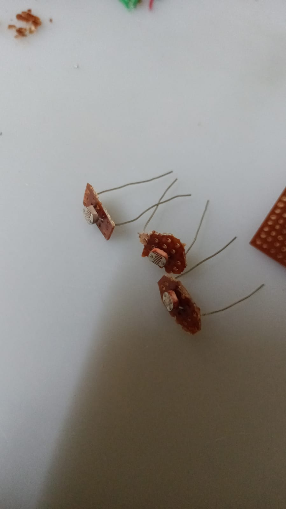
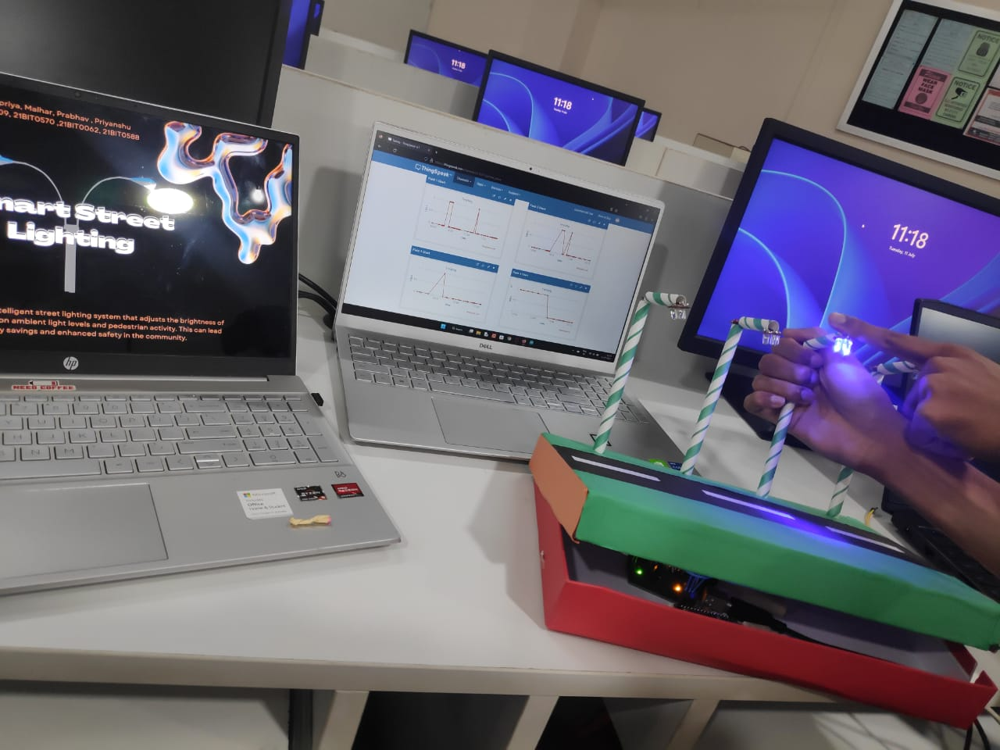

## Smart Street Lighting

(Team Project)

### Aim:

To implement an intelligent street lighting system that adjusts the
brightness of streetlights based on ambient light levels. This helps in
automation and remote monitoring of street-light infrastructure.

### Abstract

The project aims to showcase a prototype for an intelligent street
lighting system. This proof-of-concept project uses Arduino UNO as well
as NodeMCU (ESP8266 -- Used for its Wi-Fi module). A simple,
cost-effective Light Dependant Resistor (LDR) is used as the sensor in
the setup. Street lamps are made by using paper straws and 3 LEDs
connected in parallel. The resistance of LDRs decreases with increase in
the intensity of incident light, so the current passing through them
increases -- this is read by the Arduino board, which then performs
necessary calculations based on pre-determined constants. According to
the threshold values set, if ambient light goes above the threshold, the
lamps turn off (because there is enough light). If the ambient light
value goes below this threshold, the lamp brightness is automatically
controlled based on the ambient lighting: higher the brightness level,
lower the lamp's intensity. The Arduino UNO is connected to a NodeMCU
and performs parallel and serial communication with it. The Arduino
sends Lamp status in the form of 1's and 0's (1 being ON and 0 being
OFF) to NodeMCU's digital pins and prints the lamp intensity on
NodeMCU's Serial Monitor. The NodeMCU then connects to a nearby Wi-Fi
network and sends the status of the lamps to the ThingSpeak Cloud. This
enables remote monitoring of the street-lamps, and ambient light
patterns can also be observed/analysed.

### Hardware Requirements:

-   1 x Arduino UNO

-   1 x NodeMCU

-   4 x Light Dependant Resistors (LDRs)

-   4 x Lamps (we used 3 LEDs connected in parallel for each Lamp)

-   1 x Breadboard

-   Wires and connectors (as many required)

### Software Requirements:

-   Arduino IDE

-   Library for NodeMCU operation -
    https://arduino.esp8266.com/stable/package_esp8266com_index.json

-   Other libraries required for Wi-Fi functionalities, etc.

### Team Members

-   Gaurpriya Singh Roy - 21BIT0309

-   Malhar Konde - 21BIT0570

-   Prabhav Gupta - 21BIT0062

-   Priyanshu Chauhan - 21BIT0588


### Block Diagram


### Code:

#### Code running on the Arduino UNO:

```
/* Include the "SoftwareSerial" header file
   for serial communication with NodeMCU.
   This allows half-duplex serial communication. */
#include <SoftwareSerial.h>


/* Create an instance of SoftwareSerial
   Use pins 5 and 6 of Arduino UNO for serial data transfer */
SoftwareSerial espSerial(5, 6);


/* Pins 4, 7, 8, & 12 of Arduino UNO are the OUTPUT pins that will be \
   connected to NodeMCU's D0, D1, D2, & D3 pins. \
   Pins D0, D1, D2, & D3 on NodeMCU are the INPUT pins.
   These pins will simply receive high/low signals from the Arduino pins. */
const int nodepin0 = 4;
const int nodepin1 = 7;
const int nodepin2 = 8;
const int nodepin3 = 12;


//  LEDs (of the streetlights)
const int LEDpin1 = 3;
const int LEDpin2 = 9;
const int LEDpin3 = 10;
const int LEDpin4 = 11;


// Photoresistors
const int photoPIN1 = A0;
const int photoPIN2 = A1;
const int photoPIN3 = A2;
const int photoPIN4 = A3;


/*
  The `const` variables initialized below are used during the Scaling Process in `loop()`.\
  Since the data received from the photoresistor-pins has a range of 0-1023, we need usable\
  values to work with.\


  We noticed that the LEDs followed a periodic brightness pattern\
  when we supplied values to the LED pins:
  Minimum brightness => when supplied with the value 0
  Average brightness => when supplied with the value ~125
  Maximum brightness => when supplied with the value 250


  This pattern repeated every 250 units (so at 250, 500, 750,... we had max brightness)\
  This is where we get the "max_ambient" value from.
  And this is why we need to scale down the photoresistor values between 0-250\
  (because LEDs couldn't process anything beyond 250...\
  the brightness cycle simply repeated after 250 units!)


  To scale the photoresistor value, we took inspiration from the formula used for\
  the conversion between Celsius and Fahrenheit scales of temperature.
  So we devised a similar formula:
  scaledValue = ((sensorValue / ratio) - subtractor) * multiplier
      *C      = (         (*F)         -     32    ) *   (5/9)
*/
const int threshold_light = 70; // scaled value of the threshold ambient-light
const int subtractor = 150;     // value being subtracted during the scaling process
const int multiplier = 1.8;     // multiplying factor used in the scaling process
const int max_ambient = 250;    // scaled maximum value of ambient light (based on assumptions)
const int ratio = 3;            // value used to divide the sensor value while scaling


void setup()
{
  // initializing the serial communication:
  Serial.begin(9600);
  espSerial.begin(9600);
  delay(2000);


  // Photoresistor pins set as INPUT
  pinMode(photoPIN1, INPUT);
  pinMode(photoPIN2, INPUT);
  pinMode(photoPIN3, INPUT);
  pinMode(photoPIN4, INPUT);


  // LED pins set as OUTPUT
  pinMode(LEDpin1, OUTPUT);
  pinMode(LEDpin2, OUTPUT);
  pinMode(LEDpin3, OUTPUT);
  pinMode(LEDpin4, OUTPUT);


  // Extra OUTPUT pins that control NodeMCU's pins
  pinMode(nodepin0, OUTPUT);
  pinMode(nodepin1, OUTPUT);
  pinMode(nodepin2, OUTPUT);
  pinMode(nodepin3, OUTPUT);
  Serial.println("START");
}


void loop()
{
  Serial.println("----------");
  /* -> reading analog values from photoresistors
     -> this is actually the current being received by the pins
     -> directly proportional to ambient light:
        more ambient light => less resistance => more current */
  int sensorStatus1 = analogRead(photoPIN1);
  int sensorStatus2 = analogRead(photoPIN2);
  int sensorStatus3 = analogRead(photoPIN3);
  int sensorStatus4 = analogRead(photoPIN4);


  // calculating the scaled value of ambient light
  float ambient_light1 = ((sensorStatus1 / ratio) - subtractor) * multiplier;
  float ambient_light2 = ((sensorStatus2 / ratio) - subtractor) * multiplier;
  float ambient_light3 = ((sensorStatus3 / ratio) - subtractor) * multiplier;
  float ambient_light4 = ((sensorStatus4 / ratio) - subtractor) * multiplier;


  /* -> high ambient light => low LED light
     -> a simple negative linear relationship
     -> y = -mx + c (x is ambient_light, y is LED_light) */
  float LED_light1 = max_ambient - ambient_light1;
  float LED_light2 = max_ambient - ambient_light2;
  float LED_light3 = max_ambient - ambient_light3;
  float LED_light4 = max_ambient - ambient_light4;


  /* if ambient light is more than the threshold value set above,
     then the streetlights should simply turn off.*/
  if (ambient_light1 > threshold_light)
  {
    analogWrite(LEDpin1, 0);   // LED off
    digitalWrite(nodepin0, 0); // control pin on NodeMCU
   
    /*Send data to NodeMCU via pins 5 and 6.
      This prints data on NodeMCU's serial monitor.*/
    espSerial.println("Lamp1 off");
  }
  else
  {
    analogWrite(LEDpin1, LED_light1);
    digitalWrite(nodepin0, 1); // send digital value to NodeMCU pin
    espSerial.print("Lamp1 value: ");
    espSerial.println(LED_light1);
  }


  if (ambient_light2 > threshold_light)
  {
    analogWrite(LEDpin2, 0); // LED off
    digitalWrite(nodepin1, 0);
    espSerial.println("Lamp2 off");
  }
  else
  {
    analogWrite(LEDpin2, LED_light2);
    digitalWrite(nodepin1, 1);
    espSerial.print("Lamp2 value: ");
    espSerial.println(LED_light2);
  }


  if (ambient_light3 > threshold_light)
  {
    analogWrite(LEDpin3, 0); // LED off
    digitalWrite(nodepin2, 0);
    espSerial.println("Lamp3 off");
  }
  else
  {
    analogWrite(LEDpin3, LED_light3);
    digitalWrite(nodepin2, 1);
    espSerial.print("Lamp3 value: ");
    espSerial.println(LED_light3);
  }


  if (ambient_light4 > threshold_light)
  {
    analogWrite(LEDpin4, 0); // LED off
    digitalWrite(nodepin3, 0);
    espSerial.println("Lamp4 off");
  }
  else
  {
    analogWrite(LEDpin4, LED_light4);
    digitalWrite(nodepin3, 1);
    espSerial.print("Lamp4 value: ");
    espSerial.println(LED_light4);
  }
  espSerial.println();
  delay(1000);
}
```


#### Code running on the NodeMCU:

```
#include \"ThingSpeak.h\"

#include \<ESP8266WiFi.h\>

const char ssid\[\] = \"Hotspot/WiFi Name\"; //SSID

const char pass\[\] = \"Hotspot/WiFi Password\"; // Password

const int pin0 = D0;

const int pin1 = D1;

const int pin2 = D2;

const int pin3 = D3;

WiFiClient client;

unsigned long myChannelField = 2216371; // Channel ID

const char\* myWriteAPIKey = \"0WY385VU8D9I04FH\"; // Write-API Key

void setup(){

  Serial.begin(9600);

  pinMode(pin0,INPUT);

  pinMode(pin1,INPUT);

  pinMode(pin2,INPUT);

  pinMode(pin3,INPUT);

  WiFi.mode(WIFI_STA);

  ThingSpeak.begin(client);

  if (WiFi.status() != WL_CONNECTED){

    Serial.print(\"Attempting to connect to SSID: \");

    Serial.println(ssid);

    while (WiFi.status() != WL_CONNECTED){

      WiFi.begin(ssid, pass);

      Serial.print(\".\");

      delay(5000);

    }

    Serial.println(\"\\nConnected.\");

  }

}

void loop(){

 

  ThingSpeak.writeField(myChannelField, 1, digitalRead(pin0),
myWriteAPIKey);

  ThingSpeak.writeField(myChannelField, 2, digitalRead(pin1),
myWriteAPIKey);

  ThingSpeak.writeField(myChannelField, 3, digitalRead(pin2),
myWriteAPIKey);

  ThingSpeak.writeField(myChannelField, 4, digitalRead(pin3),
myWriteAPIKey);

  delay(1000);

}
```

#### Implementation (Pictures):


(Prototype Development)


(NodeMCU communication testing)




(Lamps made with LEDs) (LDRs)


(demo model)


(Night time testing)


(Final Wiring)

#### Output:



(Project Demo in Lab)


(Live updates on ThingSpeak Cloud)